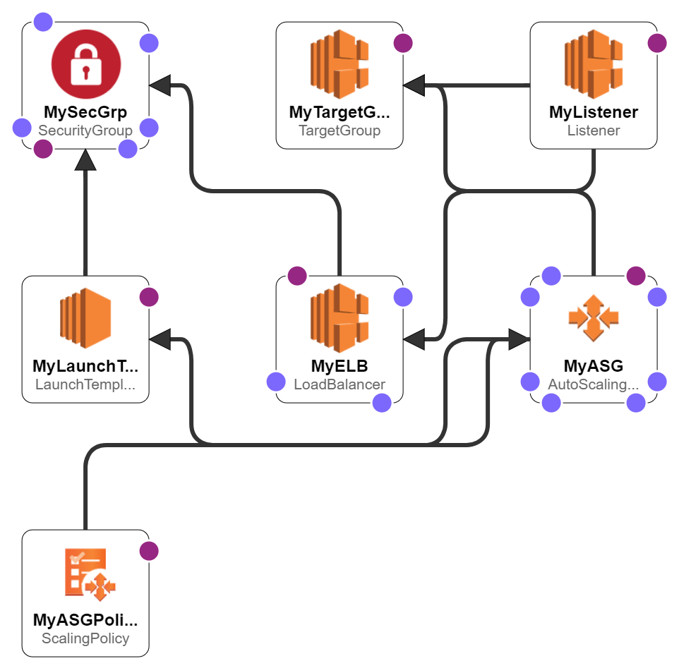

# CloudFormation Template - ASG with ELB

This CloudFormation template deploys an application environment consisting of an Auto Scaling Group (ASG) with an Elastic Load Balancer (ELB) in AWS. The template allows you to easily create and manage a scalable infrastructure for your applications.

## Expected Outcome

## Template Overview

The CloudFormation template creates the following resources:

- Auto Scaling Group (ASG): A group of EC2 instances that automatically scales based on predefined conditions.
- Elastic Load Balancer (ELB): Distributes incoming traffic across multiple EC2 instances in the ASG.
- Launch Template: Defines the configuration details for the EC2 instances in the ASG.
- Security Group: Controls inbound and outbound traffic for the EC2 instances.

## Parameters

The template provides the following configurable parameters:

- VPC: Select a Virtual Private Cloud (VPC) for the ASG and ELB.
- InstanceType: Choose an instance type for the EC2 instances.
- MyKeyPair: Select an existing EC2 key pair for SSH access to the instances.
- EnvParameter: Choose the environment type for your application (e.g., "prod" or "test").
- Subnets: Choose the subnets within the VPC for the ASG and ELB.

## Usage

To deploy the ASG with ELB using this CloudFormation template, follow these steps:

- Step 1: Access the AWS Management Console.
- Step 2: Open the CloudFormation service.
- Step 3: Click "Create stack" and select "Upload a template file."
- Step 4: Choose the CloudFormation template file (CFN_ASG_W_ELB.yaml).
- Step 5: Fill in the required parameters and configure any additional settings.
- Step 6: Click "Next" to review the stack details.
- Step 7: Click "Create stack" to start the deployment.
- Step 8: Wait for the stack creation to complete.
- Step 9: Once the stack creation is successful, you can access your application through the provided ELB URL.

## Additional Information

- The template uses predefined Amazon Machine Images (AMIs) based on the selected region and environment type.
- The EC2 instances are launched with an Apache web server pre-configured.
- The template allows inbound traffic on port 80 (HTTP) and port 22 (SSH) for management purposes. Make sure to secure your environment accordingly in production.

## Notes

- For more information and customization options, please refer to the CloudFormation documentation.

## Resources

- [AWS Cloudformation User Guide](https://docs.aws.amazon.com/AWSCloudFormation/latest/UserGuide/Welcome.html)
